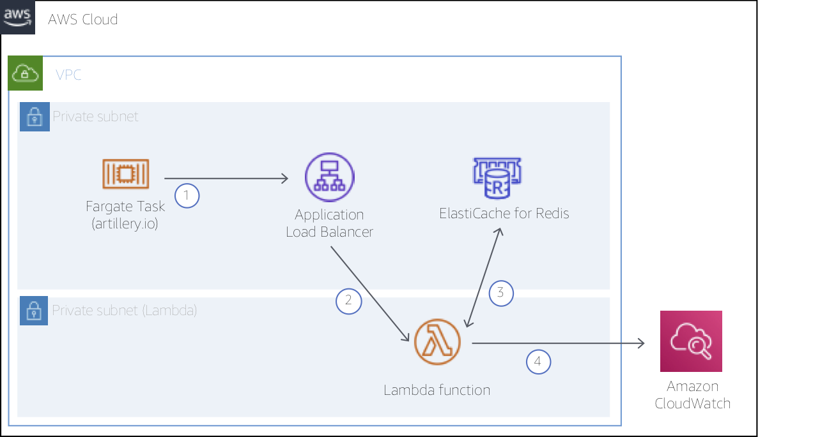
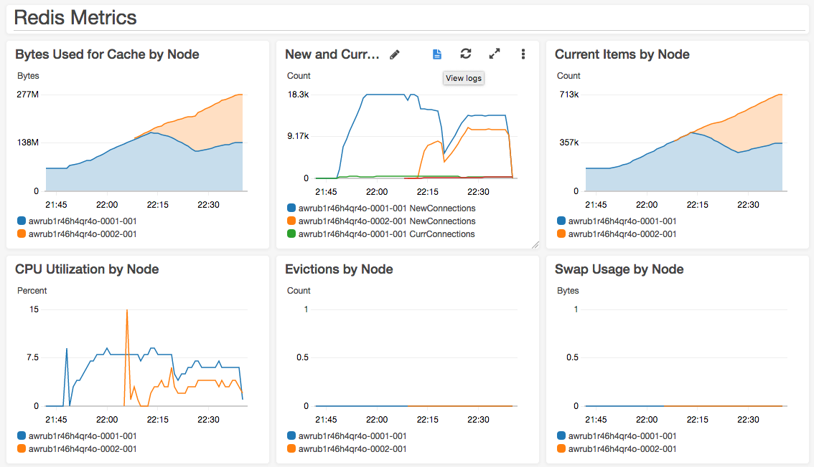
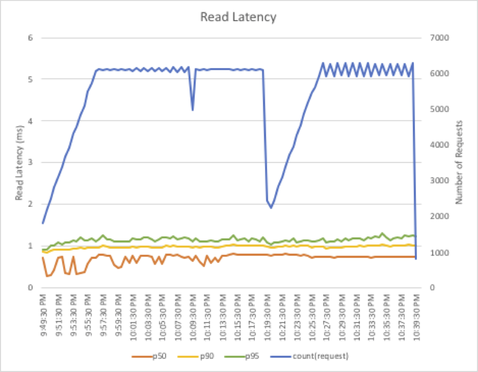

# Working with Cluster Mode on Amazon ElastiCache for Redis

This project demonstrates and measures the scaling behavior of [Amazon ElastiCache](https://aws.amazon.com/elasticache/) for Redis with Cluster Mode. ElastiCache provides a fully managed, in-memory data store that can be used for a variety of use cases. Cluster Mode allows for horizontal scaling of your ElastiCache for Redis cluster, allowing higher write activity and storage capacity. Cluster Mode also does not require a restart for scaling, nor complex changes to your application code (if any changes at all).

For this project, we have created the simple test harness shown in the diagram below. The test harness includes a new ElastiCache for Redis cluster with Cluster Mode enabled. The new cluster will start with one shard and a node type of `cache.r5.large`. We'll use an AWS Lambda function to read and write data to the cluster. The function will capture response times for those operations and write results to Amazon CloudWatch. A popular load testing tool, [Artillery](https://artillery.io), running in an AWS Fargate Task, will be used to drive traffic to an Application Load Balancer, invoking the function.



## Prerequisites

This project requires the following prerequisite tools to build and deploy code:

* [AWS CLI](https://docs.aws.amazon.com/cli/latest/userguide/installing.html)
* [Docker](https://www.docker.com/)
* [AWS Serverless Application Model CLI (AWS SAM CLI)](https://docs.aws.amazon.com/serverless-application-model/latest/developerguide/serverless-sam-cli-install.html)

For Docker and SAM CLI, follow the platform-specific instructions for your environment (e.g. Mac, Windows, Linux).

## Deploy CloudFormation stack

With the above prerequisites installed, we can now move to deploying the test stack. You will first need an Amazon S3 Bucket to be used by the SAM CLI to deploy artifacts (be sure to replace `<MY_BUCKET_NAME>` with a unique name for your bucket):

``` bash
$ aws s3 mb s3://<MY_BUCKET_NAME>
```

Next, let's deploy the project code using the SAM CLI:

``` bash
# Build the Lambda function and dependencies (note this can take a few minutes)
$ sam build --use-container

# Package the function and dependencies
$ sam package --output-template-file packaged.yaml \
                --s3-bucket <MY_BUCKET_NAME>

# Deploy...
$ sam deploy --template-file packaged.yaml \
               --stack-name aws-elasticache-cluster-mode \
               --capabilities CAPABILITY_NAMED_IAM
```

Review [template.yaml](./template.yaml) for details on the AWS resources created here, including ElastiCache, VPC, Lambda, and Fargate components. We use CloudFormation with Servelerss Application Model transforms to manage all of the resources required for the project.

## Update Artillery Config

After the CloudFormation stack deployment completes, query for the internal DNS name of the Application Load Balancer (ALB) created to front the Lambda function. To generate load for our test, Artillery will send HTTP requests to the ALB which in turn invokes the function.

``` bash
$ aws cloudformation describe-stacks --stack-name aws-elasticache-cluster-mode \
    --query 'Stacks[*].Outputs[?OutputKey==`LoadBalancerDns`].OutputValue' \
    --output text
```

Copy the return value from the above command and update the target value on line 2 of `artillery/config.yml` as follows. Be sure to save the file before moving on.

### artillery/config.yml

``` yaml
config:
  target: 'http://internal-aws-my-load-balancer.us-east-1.elb.amazonaws.com'

  ...
```

We have built a 50 minute test scenario composed of three Artillery phases here, though you could modify to design other test scenarios with higher loads, etc. See [Artillery documentation](https://artillery.io/docs/script-reference/) for details.

## Build and Push Artillery Test Harness

Next, we will build the and publish our Artillery container to the Amazon Elastic Container Registry (ECR). When we initiate our test procedure below, Fargate will pull the latest version of the container from ECR.

``` bash
# Login to AWS ECR
$ $(aws ecr get-login --no-include-email)

# Build and push artillery
$ export REPO=$(aws cloudformation describe-stacks --stack-name aws-elasticache-cluster-mode \
    --query 'Stacks[*].Outputs[?OutputKey==`ArtilleryRepository`].OutputValue' \
    --output text)
$ docker build -t elasticache-artillery artillery/
$ docker tag elasticache-artillery:latest $REPO:latest
$ docker push $REPO:latest
```

If you modify `config.yml` following this initial build, be sure to build and push to ECR again using the same steps as above.

## Visit CloudWatch Logs Dashboard

Lastly, before starting the test procedure, open a pre-built Amazon CloudWatch Dashboard in your favorite browser to keep an eye on ElastiCache and Lambda metrics:

``` bash
# Get the URL for the CloudWatch Dashboard
$ aws cloudformation describe-stacks --stack-name aws-elasticache-cluster-mode \
    --query 'Stacks[*].Outputs[?OutputKey==`CloudWatchDashboard`].OutputValue' \
    --output text
```

Copy resulting URL and open in your favorite browser.

> The dashboard in this project makes use of [CloudWatch Logs Insights](https://docs.aws.amazon.com/AmazonCloudWatch/latest/logs/AnalyzingLogData.html). For detais on the syntax of these queries, see [CloudWatch Logs Query Syntax](https://docs.aws.amazon.com/AmazonCloudWatch/latest/logs/CWL_QuerySyntax.html).

## Initiate Test Sequence

We're now ready to launch our test. We'll start by gathering the Security Group, Subnets, and Cluster name to be used for our Artillery tasks. With that data, we can launch the tasks to begin to generate load on the ElastiCache cluster. Here, we launch three tasks, though you could increase the number (up to 10) or decrease as well.

``` bash
# Grab some data
$ export SG=$(aws cloudformation describe-stacks --stack-name aws-elasticache-cluster-mode \
    --query 'Stacks[*].Outputs[?OutputKey==`ArtillerySecurityGroup`].OutputValue' \
    --output text)

$ export SUBNETS=$(aws cloudformation describe-stacks --stack-name aws-elasticache-cluster-mode \
    --query 'Stacks[*].Outputs[?OutputKey==`PrivateSubnets`].OutputValue' \
    --output text)

$ export CLUSTER=$(aws cloudformation describe-stacks --stack-name aws-elasticache-cluster-mode \
    --query 'Stacks[*].Outputs[?OutputKey==`ArtilleryCluster`].OutputValue' \
    --output text)

# Run Artillery Fargate task
$ aws ecs run-task \
    --cluster $CLUSTER \
    --task-definition aws-elasticache-cluster-mode-task \
    --count 3 \
    --launch-type FARGATE \
    --network-configuration "awsvpcConfiguration={subnets=[$SUBNETS],securityGroups=[$SG],assignPublicIp=DISABLED}"

```

After launching the Fargate tasks, jump back to the CloudWatch Dashboard to watch load start to build on ElastiCache.

## Scale ElastiCache Cluster

Wait approximately 15 minutes after starting the Artillery tasks, then horizontally scale the ElastiCache cluster by adding a second shard as follows ([docs](https://docs.aws.amazon.com/AmazonElastiCache/latest/red-ug/redis-cluster-resharding-online.html#redis-cluster-resharding-online-add-cli)):

``` bash
$ export ECCLUSTER=$(aws cloudformation describe-stacks --stack-name aws-elasticache-cluster-mode \
    --query 'Stacks[*].Outputs[?OutputKey==`RedisCluster`].OutputValue' \
    --output text)

$ aws elasticache modify-replication-group-shard-configuration \
    --replication-group-id $ECCLUSTER \
    --node-group-count 2 \
    --apply-immediately
```

It will take several minutes for the new shard to be created and then a few more minutes for ElastiCache to automatically rebalance the keyspace between the old and new shards. In the dashboard, you will be able to see the new shard come in to service and begin to accept connections.



At the bottom of the dashboard, review the latency metrics collected by the Lambda function. Notice that neither reads, writes, nor connection latencies are dramatically impacted by the scaling operations, nor did we need to incur a restart. The read latency results of one of our test runs is as follows; notice that ElastiCache for Redis is both fast and consistent:



## Cleaning Up

When finished, you can cleanup the AWS resources used in this project:

``` bash
$ aws cloudformation delete-stack --stack-name aws-elasticache-cluster-mode
```

## License Summary

The documentation is made available under the Creative Commons Attribution-ShareAlike 4.0 International License. See the LICENSE file.

The sample code within this documentation is made available under the MIT-0 license. See the LICENSE-SAMPLECODE file.

